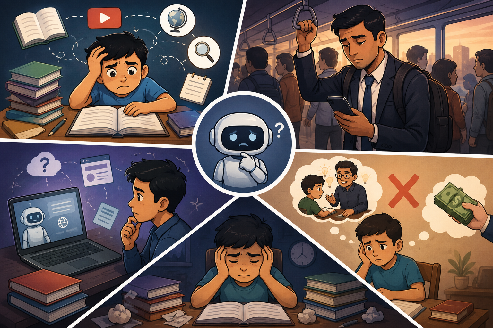

# 🎓 ExamBuddy AI

**Your 24/7 AI voice teacher for school students and competitive exam aspirants.**

> 🌟 **Ask questions out loud — anywhere, anytime.**

---

## 📌 What is ExamBuddy AI?

ExamBuddy AI is a voice-based AI learning companion designed for learners across India.

Whether a student is studying Class 6 Science, preparing for a board examination, or aiming for UPSC, TNPSC, SSC, Banking, or Railway exams, ExamBuddy AI turns learning into a natural conversation.

Instead of searching through textbooks, PDFs, videos, and notes, learners simply ask questions using their voice and receive instant, syllabus-aligned answers.

> *"What if every student could talk to their syllabus the way they talk to a teacher?"*

---

## ✨ The Problem 

Learning today is fragmented, time-consuming, and often inaccessible when students need help the most.

<table>
<tr>
<td width="50%" align="center" valign="middle">



</td>
<td width="60%" valign="top">


- **Students struggle with scattered resources**
Learners switch between textbooks, notes, videos, websites, and coaching materials, wasting time finding the right explanation.

- **Aspirants lose valuable time**
Working professionals and busy students struggle to use commuting or daily routines for revision due to screen-based learning limits.

- **General AI lacks syllabus focus**
Most AI tools give generic answers without aligning to school boards, TNPSC, UPSC, or exam-specific patterns.

- **Personalized guidance is limited**
Many learners cannot access affordable one-to-one tutoring, leading to lack of feedback and targeted practice.

</td>
</tr>
</table>

### 🎯 The Result

Students spend more time searching for information than actually learning it. Valuable learning opportunities are lost, revision becomes inefficient, and preparation often feels overwhelming.

---

## ✅ The Solution

<table>
<tr>
<td width="40%" align="center" valign="middle">


</td>
<td width="60%" valign="top">

ExamBuddy AI transforms learning into a conversation.

### School Student

```text
Student : Explain Photosynthesis.
AI      : Gives a simple, age-appropriate explanation.

Student : Ask me 5 questions from this chapter.
AI      : Generates chapter-based practice questions instantly.
```

### Competitive Exam Aspirant

```text
Student : Explain Fundamental Rights for UPSC Prelims.
AI      : Gives a concise, exam-oriented explanation.

Student : Now test me with 5 PYQ-style MCQs.
AI      : Generates topic-specific exam questions instantly.
```
> **🌟 Just ask. Just learn.**

</td>
</tr>
</table>

---

## 🤖 Key Features

| Feature                         | Description                                                          |
| ------------------------------- | -------------------------------------------------------------------- |
| 🎙 Voice Q&A                    | Ask questions naturally using your voice and receive spoken answers. |
| 📝 MCQ Generator                | Instantly generate topic-wise practice questions with explanations.  |
| 📚 Topic Summaries              | Revision-ready summaries in under 60 seconds.                        |
| 📄 Revision Notes               | AI-generated notes tailored to the learner's level and exam.         |
| 🎯 Adaptive Learning            | AI tracks learning patterns and adjusts depth over time.             |
| 🔍 Source-Grounded Answers      | Responses anchored in trusted educational content and PYQs.          |
| 🧠 Personalized Learning Memory | Remembers covered topics and identifies weak areas.                  |

---

## 🔑 Key Layer

| Layer           | Details                                                                             |
| --------------- | ----------------------------------------------------------------------------------- |
| 🎙 Voice Layer  | Speech-to-text input and text-to-speech output with low latency.                    |
| 🧠 LLM Core     | Large Language Model optimized for concise educational responses.                   |
| 📚 RAG Pipeline | Vector database containing NCERT, Samacheer, PYQs, and trusted educational content. |
| 📝 MCQ Engine   | Structured question generation with difficulty levels and explanations.             |
| 👤 User Memory  | Tracks progress, weak areas, and learning history.                                  |
| 🔗 Backend API  | Session management, content retrieval, subscriptions, and analytics.                |

---

## 🏗️ Tech Architecture


---

## 🤝 API partner

| Layer                       | API                                       |
| --------------------------- | ----------------------------------------- |
| Speech-to-Text              | Whisper                                   |
| Primary LLM - 80%           | Meta Llama                                |
| Fallback LLM -  20%         | OpenAI GPT                                |
| Text-to-Speech              | Google WaveNet                            |

---

## 🚀 Prototype

**Desktop View**

[https://raguram-n.github.io/Exam_Buddy_proposal/](https://raguram-n.github.io/Exam_Buddy_proposal/)

---

## 📚 Trusted Knowledge Sources

All AI responses are grounded in verified and syllabus-aligned content.

### School Education

* NCERT Textbooks
* Samacheer Kalvi Textbooks
* CBSE Learning Resources
* State Board Textbooks
* Board Examination Question Banks

### Competitive Exams

* NCERT Books
* Standard Reference Sources
* Previous Year Question Papers (PYQs)
* Official Answer Keys
* Government Publications

---

## 🎯 Target Users

### Initial Focus

* Schools (Classes 6–12)
* TNPSC Aspirants
* UPSC Aspirants
* SSC Aspirants
* Banking Aspirants
* Railway Aspirants

### Future Expansion

* NEET
* JEE
* CUET
* Professional Certifications
* Skill Development Programs
* Regional Language Learning Support

---

## 💰 Business Model

### B2C — Individual Learners

| Plan    | Price      | Includes                                                                            |
| ------- | ---------- | ----------------------------------------------------------------------------------- |
| Free    | ₹0         | Limited voice queries, basic explanations, and trial access                         |
| Premium | ₹199/month | Voice learning, unlimited MCQs, revision notes, summaries, and personalized support |

---

### B2B — Schools & Coaching Institutes

| Plan    | Price         | Best For                                                      |
| ------- | ------------- | ------------------------------------------------------------- |
| Starter | ₹10,000/month | Up to 200 students                                            |
| Growth  | ₹25,000/month | Up to 750 students with analytics and custom content          |
| Scale   | ₹50,000/month | Unlimited students, white-label deployment, dedicated support |

---

## 📈 Market Opportunity

India has over **250 million school students** and **tens of millions of competitive exam aspirants**, creating one of the world's largest education markets.

Even modest adoption can create a sustainable and scalable business.

| Conversion | Paid Users | Monthly Revenue | Annual Revenue |
| ---------- | ---------- | --------------- | -------------- |
| 1%         | 1,000      | ₹1.99 Lakhs     | ₹23.88 Lakhs   |
| 5%         | 5,000      | ₹9.95 Lakhs     | ₹1.19 Crores   |
| 10%        | 10,000     | ₹19.9 Lakhs     | ₹2.38 Crores   |

> A single Growth-tier institute partnership (₹25,000/month) equals approximately 125 individual Premium subscribers.

---

## 🤝 We're Looking For

We're building this in two stages — a lean core team to prove the concept, then a fuller team once we have traction and funding to scale.

### Phase 1 — MVP Team (Now)

| Role | Focus Area |
|------|------------|
| AI/ML Engineer | RAG pipeline (content ingestion, embeddings, retrieval), prompt design for explanations and MCQ generation, syllabus accuracy evaluation |
| Full Stack Developer | Backend APIs, auth and session management, third-party voice (STT/TTS) integration, minimal app/web shell |

---

### Phase 2 — Live Production Team (Post-MVP / Post-Funding)

| Role | Focus Area |
|------|------------|
| AI/ML Engineers | Multi-subject and multi-exam RAG scaling, voice optimization, adaptive learning models |
| Full Stack Developers | Real-time audio streaming at scale, subscriptions and billing, multi-platform APIs |
| UI/UX Designers | Mobile-first learning experiences, accessibility, regional language support |
| DevOps/Cloud Engineers | Infrastructure scaling, latency optimization, cost management as usage grows |
| QA/Test Engineers | Educational accuracy across subjects/exams, AI evaluation, continuous content QA |

If you're excited about building technology that can improve learning outcomes for millions of students, we'd love to connect — starting with the Phase 1 roles above.

---

## 🌟 Vision

To build India's most accessible AI teacher that helps learners study through conversation—whether they are preparing for a Class 6 science test, a Class 12 board examination, or the UPSC Civil Services Examination.

---

## 👤 Author

**Raguram Narayanaswamy**
